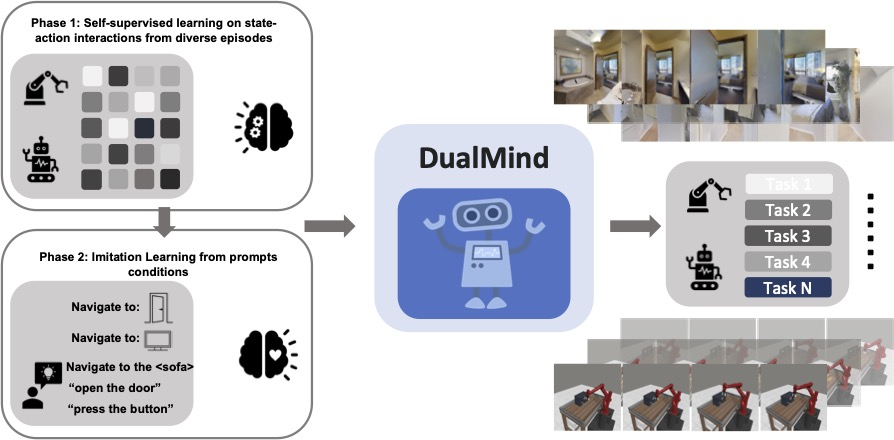
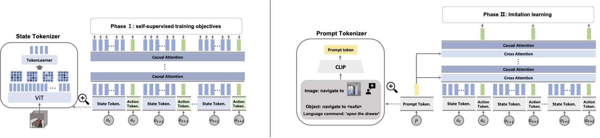

# DualMind: Is Imitation All You Need? Generalized Decision-Making with Dual-Phase Training

This repository contains the PyTorch implementation of the DualMind model proposed in our
paper


<p align="center">

</p>

## Abstract

We introduce DualMind, a generalist agent designed to tackle various decision-making tasks that addresses challenges
posed by current methods, such as overfitting behaviors and dependence on task-specific fine-tuning. DualMind uses a
novel “Dual-phase” training strategy that emulates how humans learn to act in the world. The model first learns
fundamental common knowledge through a self-supervised objective tailored for control tasks and then learns how to make
decisions based on different contexts through imitating behaviors conditioned on given prompts. DualMind can handle
tasks across domains, scenes, and embodiments using just a single set of model weights and can execute zero-shot
prompting without requiring task-specific fine-tuning.

<!-- <p align="center">

</p> -->

## Setting up:

```
conda create -n dualmind python=3.7 -y
conda activate dualmind
```

Install other requirements for this repository:

```
conda install pytorch=1.10.0 torchvision=0.11.1 -c pytorch -y
pip install -r requirements.txt
pip install git+https://github.com/openai/CLIP.git
```

(Optional) Install habitat data generation and evaluation environment.

Install [habitat-lab](https://github.com/facebookresearch/habitat-lab)
and [habitat-sim](https://github.com/facebookresearch/habitat-sim):

- conda install habitat-sim
   ```
   conda install habitat-sim=0.2.2 withbullet headless -c conda-forge -c aihabitat
   ```
- pip install habitat-lab=0.2.2
   ```
   git clone --branch v0.2.2 https://github.com/facebookresearch/habitat-lab.git
   cd habitat-lab
   pip install -e .
  ```
- You can download the datasets used in this work from the
  following [website](https://github.com/facebookresearch/habitat-lab/blob/main/DATASETS.md).

(Optional) Install metaworld data generation and evaluation environment.

```
git clone https://github.com/rlworkgroup/metaworld.git
cd metaworld
pip install -e .
```

## Dataset Preparation

### Data generation

- Habitat data generation
   ```
   python data_generate/habitat_data.py
   ```
- Metaworld data generation
   ```
   python data_generate/metaworld_data.py
   ```

### Dataset structure

For simplicity and uniformity, all our datasets are structured in the following way:

```

/path/to/data/
├── gibson/
│   ├── scene1/
│   │   ├── scene1_1.zip
│   │   └── scene1_2.zip
│   └── scene2/
│       ├── scene2_1.zip
│       └── scene2_2.zip
├── mp3d/
│   ├── scene1/
│   │   ├── scene1_1.zip
│   │   └── scene1_2.zip
│   └── scene2/
│       ├── scene2_1.zip
│       └── scene2_2.zip
├── train_habitat.json
└── train_metaworld.json
```

## Training

### Phase 1 training:

Phase 1 training with habitat and metaworld data.

```
python src/train.py --is_aug \
        --devices 1 --nodes 1 --vocab_size 5 --token_decoder tokenlearner  \
        --training_phase 1 --epochs 10 --n_embd 512 --batch_size 16  --lr 5e-5 \
        --n_layer 6 --n_head 8 --seed 123 --context_length 6 \
        --dataset_dir path/to/data --metaworld_file_path train_metaworld.json \
        --habitat_file_path train_habitat.json --num_workers 1 \
        --inverse --rand_inverse --forward --rand_mask_size -1 --mask_obs_size -1 \
        --output_dir phase1_train  \
        --encoder path/to/pretrain_encoder 
```

### Phase 2 training:

Phase 2 training with habitat and metaworld data.

```
python src/train.py --is_aug --ft_params 1 \
        --devices 1 --nodes 1 --vocab_size 5 --token_decoder tokenlearner  \
        --training_phase 1 --epochs 10 --n_embd 512 --batch_size 16 --lr 5e-5 \
        --n_layer 6 --n_head 8 --seed 123 --context_length 6 \
        --dataset_dir path/to/data --metaworld_file_path train_metaworld.json \
        --habitat_file_path train_habitat.json --num_workers 1 \
        --output_dir phase2_train  \
        --encoder path/to/pretrain_encoder \
        --load_model_from path/to/model
```

Note that if --metaworld_file_path or --habitat_file_path is not specified, the model is trained from single domain.

## Pretrained models

Download the pretrained model from here: [multidomain](), [metaworld]() and [habitat]()

## Evaluation

### Metaworld:

To evaluate our model on Metaworld `<META_TYPE>` (MT10, ML10, ML45, MT50) split, run the following command:

```
python src/evaluate_mw.py   --seed 3231    --context_length 6  --n_layer 8     --n_head 8 --n_embd 512   --vocab_size 5 --ft_type meta --episodes 10 --meta_type ML45
 --load_model_from path/to/model
```


### Habitat:

To evaluate our model on Habitat `<difficulty>` (easy, medium, hard) split, run the following command:

```
python src/evaluate.py --seed 3231 --context_length 6 --n_layer 8 --n_head 8 --n_embd 512 --vocab_size 5 --task_type imagenav --difficulty easy \
 --load_model_from path/to/model
```

## Acknowledgement

This repository is built using the [timm](https://github.com/rwightman/pytorch-image-models/tree/master/timm)
,and  [MultiMAE](https://github.com/EPFL-VILAB/MultiMAE#readme) repositories.

## License and Citation:

This project is licensed under the terms of the MIT license. By using the software, you are agreeing to the terms of
the [license agreement](LICENSE).
If you use this code in your research, please cite our work as follows:

```bibtex

```


